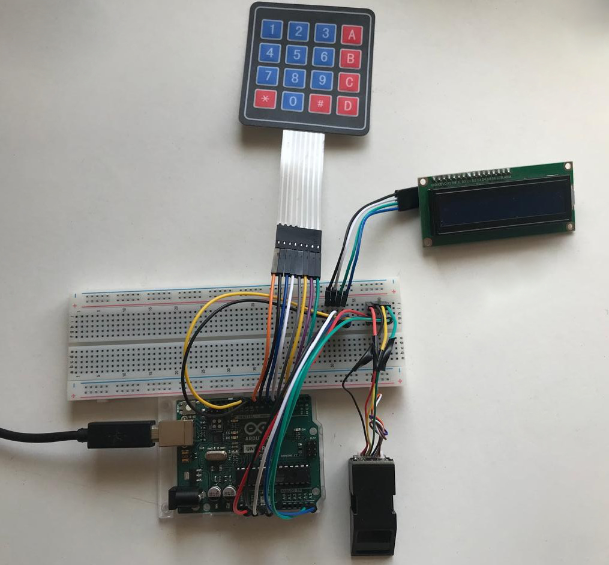
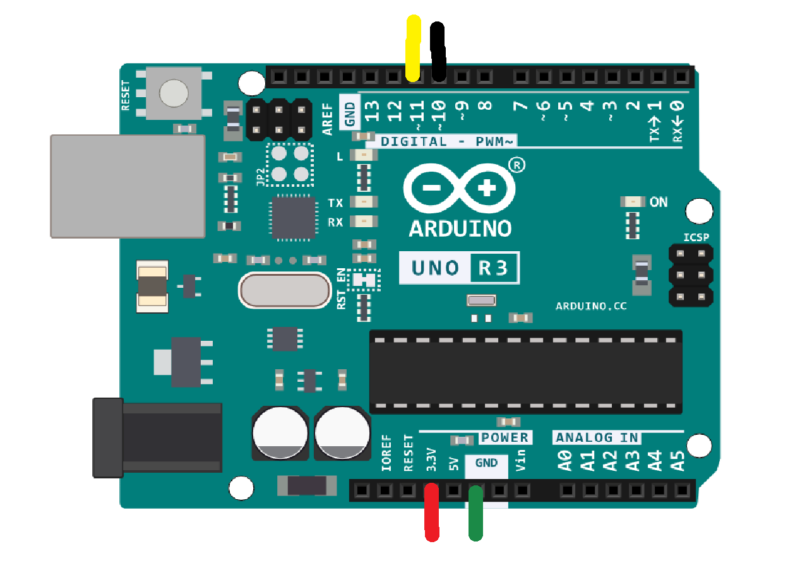
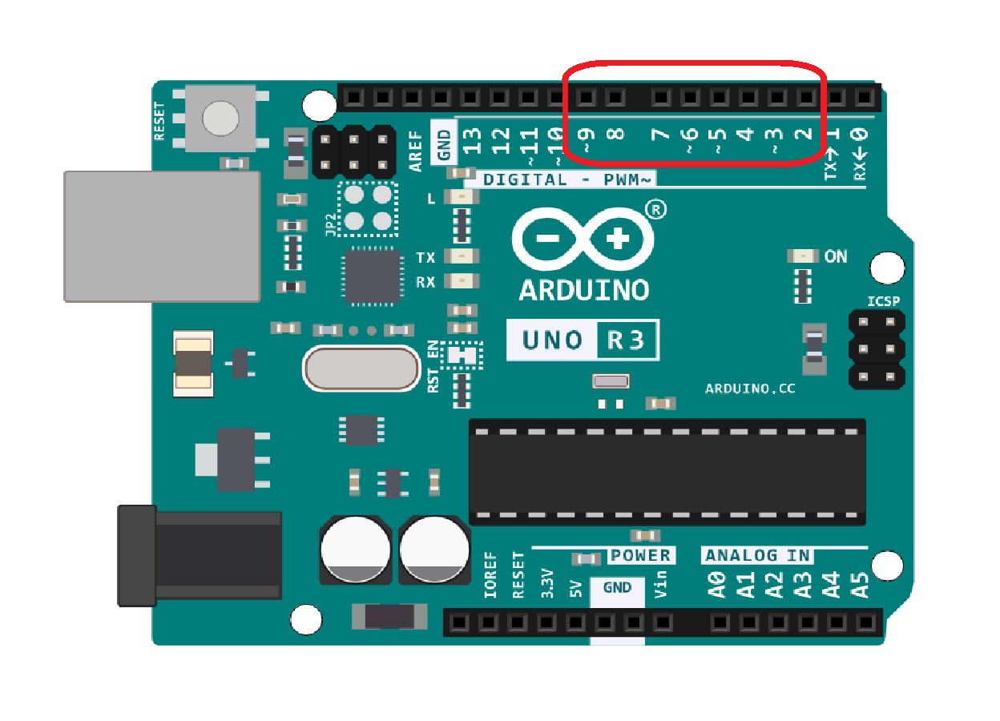
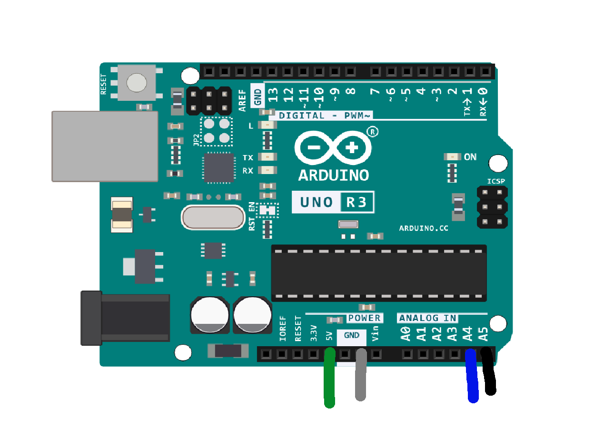
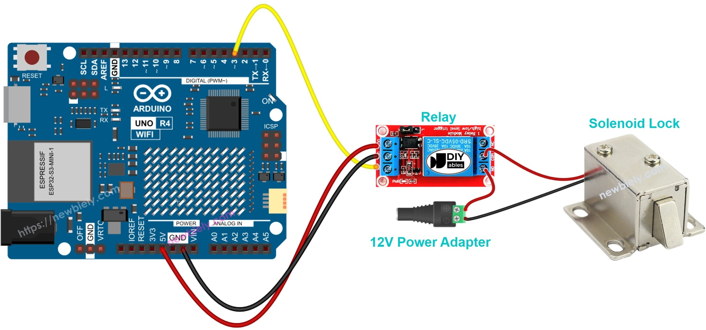

<div align="center">
  
  <h1>Control de Acceso Biométrico con Arduino</h1>
  <p><strong>Sistema de acceso de doble factor (Huella Dactilar + PIN) con Arduino, Python y MySQL.</strong></p>
  <p><a href="https://youtube.com/watch?v=JEN6ze8029M">Video Tutorial en YouTube</a></p>
</div>

---

## 📖 Descripción del Proyecto

Sistema de seguridad de **doble factor** que combina hardware (Arduino) con una interfaz de administración de escritorio (Python). El acceso a una puerta se controla con un **sensor biométrico AS608** y un **teclado numérico**. Toda la gestión de usuarios se almacena en una base de datos **MySQL**.

La idea central: **el Arduino no guarda los datos de los usuarios**. El _sensor_ almacena las plantillas de huella por un ID numérico (1–127); el resto (nombre, PIN, rol, estado) vive en MySQL. Como el firmware no puede consultar la base de datos, **le pregunta a la PC por el puerto serial** y la aplicación Python responde tras consultar MySQL. Esa línea serial es el contrato entre las dos mitades.

<div align="center">
  
</div>

## 🎯 Características Principales

- **Autenticación en 2 pasos** (huella + PIN físico).
- **Interfaz gráfica moderna** en Python (`customtkinter`).
- **Gestión de usuarios en MySQL**.
- **Auto-flasheo inteligente**, al entrar a _Ingresar_ o _Gestionar_, la app compila y sube el sketch correspondiente al Arduino con `arduino-cli`, sin intervención manual.
- **Exportación a CSV** y registro de acciones en `registro.log`.

---

## 🛠️ Hardware Necesario

| Componente      | Detalle                                                           |
| --------------- | ----------------------------------------------------------------- |
| Placa principal | Arduino Uno R3 (o compatible).                                    |
| Biometría       | Sensor de huellas AS608.                                          |
| Pantalla        | LCD 1602 con módulo I2C.                                          |
| Teclado         | Keypad matricial 4x4.                                             |
| Actuador        | Relé y cerradura solenoide.                                       |
| Varios          | Protoboard, cables jumpers, fuente de 12V para la cerradura, etc. |

### Conexiones (pinout del Arduino Uno)

| Periférico             | Pines del Arduino        |
| ---------------------- | ------------------------ |
| Sensor AS608           | `10` (RX) y `11` (TX).   |
| Teclado 4x4 - Filas    | `9, 8, 7, 6`.            |
| Teclado 4x4 - Columnas | `5, 4, 3, 2`.            |
| LCD I2C                | `A4` (SDA) y `A5` (SCL). |
| Relé + Cerradura       | `13`.                    |
| PC                     | USB.                     |

> ⚠️ Ojo con los dos baud rates: la comunicación **PC ↔ Arduino** es a **9600**, mientras que la del **Arduino ↔ sensor AS608** (por `SoftwareSerial`) es a **57600**.

<div align="center">
  
  <br/>
  
  
  <br/><sub>Sensor (10/11) · Teclado (2–9) · LCD I2C (A4/A5) · Relé + Cerradura (pin 13)</sub>
</div>

---

## 💿 Software Necesario

| Software            | Descarga                                       |
| ------------------- | ---------------------------------------------- |
| **XAMPP** (MySQL)   | https://www.apachefriends.org/es/download.html |
| **Python/Anaconda** | https://www.anaconda.com/download/success      |
| **Arduino IDE**     | https://www.arduino.cc/en/software/            |
| **VS Code**         | https://code.visualstudio.com/                 |

> 📺 Referencia del uso de la protoboard: https://www.youtube.com/watch?v=wOdlHIrvi80

---

## 📂 Estructura del Repositorio

```text
/
├── app/                             # Aplicación de escritorio (Python + customtkinter).
│   ├── principal.py                 # Menú principal (punto de entrada).
│   ├── login.py                     # Login de administrador (.env o BD).
│   ├── ingresar.py                  # Modo verificación: puente serial ↔ MySQL.
│   ├── gestionar.py                 # CRUD de usuarios + registro de huellas.
│   ├── arduino_uploader.py          # Auto-flasheo con arduino-cli.
│   └── .env.example                 # Plantilla de credenciales maestras.
├── arduino/                         # Firmware que la app sube automáticamente.
│   ├── ingresar/ingresar.ino        # Verificación de acceso (huella + PIN).
│   └── insertar/insertar.ino        # Enrolamiento de huella.
├── herramientas-sensor/             # Sketches de mantenimiento del sensor (manual, IDE Arduino).
│   ├── enroll.ino                   # Registrar huella sin base de datos.
│   ├── delete.ino                   # Borrar una huella por ID.
│   ├── empty.ino                    # Vaciar TODO el sensor (irreversible).
│   └── README.md
├── database/
│   ├── database.sql                 # Crea la tabla `usuarios` (BD `proyecto_huella`).
│   └── documentacion-database.pdf   # Documentación de la base de datos.
├── tools/                           # Dependencias del proyecto.
│   ├── arduino-cli.exe              # Compilador/uploader usado por la app.
│   └── librerias/
│       ├── arduino/*.zip            # Librerías Arduino (Adafruit_Fingerprint, Keypad, LCD…).
│       └── python/instalacion.ipynb
├── media/                           # Imágenes usadas por este README.
└── README.md
```

---

## 🗄️ Base de Datos

Una sola tabla, `usuarios`, dentro de la base `proyecto_huella`:

| Campo       | Tipo                      |
| ----------- | ------------------------- |
| `id`        | INT AUTO_INCREMENT PK     |
| `huella_id` | INT UNIQUE NOT NULL       |
| `rut`       | VARCHAR(12) UNIQUE        |
| `pin`       | VARCHAR(5)                |
| `rol`       | ENUM(`empleado`,`admin`)  |
| `estado`    | ENUM(`activo`,`inactivo`) |
| `creado_en` | TIMESTAMP                 |

📄 Documentación detallada de la base de datos (esquema, consultas que hace la app y validaciones) en
[`database/documentacion-database.pdf`](database/documentacion-database.pdf).

> La app se conecta a MySQL como `root` sin contraseña a la base `proyecto_huella`. Estos datos están escritos directamente en `login.py`, `gestionar.py` e `ingresar.py` (no se leen del `.env`); ajústalos en los tres archivos si tu MySQL es distinto.

---

## 🚀 Guía de Instalación

### 1. Software base

Instala XAMPP, Python (o Anaconda) y el Arduino IDE (ver la sección [Software Necesario](#-software-necesario) con los enlaces de descarga).

### 2. Base de datos

```sql
CREATE DATABASE proyecto_huella;
USE proyecto_huella;
SOURCE database/database.sql;   -- crea la tabla `usuarios`
```

### 3. Entorno de Python

La app necesita estos paquetes:

| Paquete                  | Uso                                            |
| ------------------------ | ---------------------------------------------- |
| `customtkinter`          | Interfaz gráfica moderna.                      |
| `pyserial`               | Comunicación serial con el Arduino.            |
| `mysql-connector-python` | Conexión a la base de datos MySQL.             |
| `python-dotenv`          | Carga de credenciales desde el archivo `.env`. |

```bash
python -m venv venv
venv\Scripts\activate
pip install customtkinter pyserial mysql-connector-python python-dotenv
```

Luego copia la plantilla de credenciales maestras del administrador:

```bash
copy app\.env.example app\.env
```

```env
# app/.env
ADMIN_USER=tu_usuario
ADMIN_PIN=12345
```

### 4. Toolchain de Arduino

La app usa el `arduino-cli.exe` incluido en `tools/`. Ese binario necesita el core `arduino:avr` y las librerías que vienen como `.zip` en `tools/librerias/arduino/`. Instálalas una sola vez (desde la raíz del repo):

```bash
# Core de placas AVR (si no lo tienes ya)
tools\arduino-cli.exe core install arduino:avr

# Librerías necesarias (vienen bundleadas en el repo)
tools\arduino-cli.exe config set library.enable_unsafe_install true
tools\arduino-cli.exe lib install --zip-path tools\librerias\arduino\Adafruit_Fingerprint_Sensor_Library.zip
tools\arduino-cli.exe lib install --zip-path tools\librerias\arduino\Keypad.zip
tools\arduino-cli.exe lib install --zip-path tools\librerias\arduino\LiquidCrystal_I2C.zip
```

> Verificación rápida: `tools\arduino-cli.exe compile --fqbn arduino:avr:uno arduino\ingresar` debe compilar sin errores.

### 5. Puerto serial

Conecta el Arduino por USB y revisa en qué puerto COM quedó. Por defecto el proyecto usa **`COM6`**. Si el tuyo es otro, cámbialo en:

- `app/arduino_uploader.py` (`PUERTO`).
- `app/ingresar.py` y `app/gestionar.py` (`serial.Serial('COM6', ...)`).

### 6. Ejecutar

```bash
cd app
python principal.py
```

---

## 🧭 Flujo de Uso

### Registrar un usuario (Gestionar)

1. En el menú, entra a **Gestionar** e inicia sesión (credenciales del `.env` o un admin `activo` de la BD).
2. Pulsa **Insertar**: la app sube automáticamente `arduino/insertar/insertar.ino` al Arduino.
3. Ingresa un _Huella ID_ (1–127) y coloca el dedo **dos veces** cuando el sensor lo indique.
4. Completa el formulario (nombre, RUT, PIN, rol, estado) y guarda en MySQL.

### Ingresar (verificación de acceso)

1. En el menú, entra a **Ingresar**: la app sube `arduino/ingresar/ingresar.ino`.
2. Coloca el dedo → el Arduino pregunta el nombre a la PC → escribe el PIN en el teclado.
3. Si **huella + PIN** corresponden a un usuario `activo`, se abre la cerradura (relé).

### Protocolo serial (contrato firmware ↔ Python)

**Enrolamiento** (`insertar.ino` ⇄ `gestionar.py`):

```
Arduino → READY
PC      → <id>
Arduino → ENROLL_OK | ENROLL_FAIL
```

**Verificación** (`ingresar.ino` ⇄ `ingresar.py`):

```
Arduino → CONSULTAR_ID:<id>
PC      → nombre:<nombre> | nombre:desconocido
Arduino → VERIFICAR:<id>:<pin>
PC      → permitido:<nombre> | denegado
```

---

## ⚠️ Herramientas de Mantenimiento del Sensor

En [`herramientas-sensor/`](herramientas-sensor/) hay tres sketches **independientes** de la app (ejemplos genéricos del sensor), que se suben manualmente con el **Arduino IDE** (monitor serie a **9600 baud**):

- `enroll.ino` — registrar una huella sin pasar por la base de datos.
- `delete.ino` — borrar una huella por su ID.
- `empty.ino` — **formatea y borra todas** las huellas del sensor (irreversible).

> No uses estas herramientas y la app de Python al mismo tiempo: ambas compiten por el mismo puerto COM.

---

## 👤 Contacto

Si tienes alguna pregunta o deseas colaborar en algún proyecto, no dudes en ponerte en contacto:

- **Nombre:** Luis Andrés Melita Cruces
- **Email:** [melitacruces@gmail.com](mailto:melitacruces@gmail.com)
- **LinkedIn:** [linkedin.com/in/melitacruces](https://linkedin.com/in/melitacruces)
- **GitHub:** [github.com/melitacruces](https://github.com/melitacruces)
- **Ubicación:** Concepción, Chile
